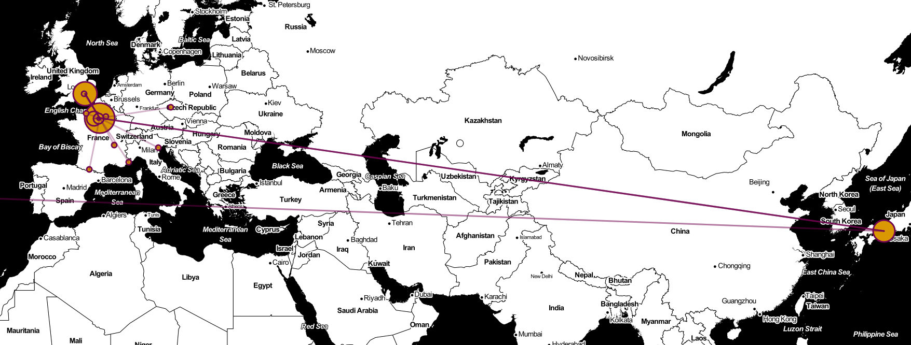

# MODÉLISER ET EXPLOITER DES CORPUS TEXTUELS



Supports pour la journée d'atelier [Modéliser et exploiter des corpus textuels](https://odhn.ens.psl.eu/evenements/atelier-modeliser-et-exploiter-des-corpus-textuels), donnée avec Léa Saint-Raymond à l'ENS-PSL (31.03.2023). Cette journée 
vise à introduire aux bases de la modélisation en XML-TEI, et surtout, aux méthodes d'analyse automatique,
de fouille de texte et de visualisation de corpus XML avec Python. 

La journée est organisée en deux parties:
- le matin, on présente l'histoire du XML et de la TEI ainsi que les principes de base de la TEI
  à partir d'un atelier d'encodage "à la main".
- l'après-midi est consacré à l'analyse outillée d'un corpus encodé en XML avec Python (analyse de 
  réseaux, cartographie, reconnaissance d'entités nommées, API, manipulation et fouille de documents
  TEI)

---

## Structure du dépôt

```
/racine
  |__google_colab/  les notebooks utilisables en ligne sur Google Colab
  |
  |__jupyter_notebook/  les notebooks utilisables localement sur Jupyter Notebook
  |
  |__slides/  les slides de la matinée (présentation du XML-TEI)
  |
  |__src/  le code source utilisé pour l'atelier
  |   |__txt2xml.py  chaîne d'encodage automatique du texte brut au XML-TEI (bonus!)
  |   |__xmlanalysis.py  chaîne de fouille des corpus XML-TEI. code source de
  |                      l'atelier à proprement parler
  |
  |__txt/  dossier contenant les fichiers en texte brut encodés en TEI avec `src/txt2xml.py`
  |  
  |__web/  dossier de sortie de `xmlanalysis`
  |   |__json/  dossier contenant des geojson récupérés de l'API nominatim contenant les infos
  |   |         géolocalisées sur le corpus
  |   |__network.html  la visualisation du réseau d'expéditeurices/destinataires du corpus Matsutaka
  |   |                produit automatiquement
  |   |__map.html  une visualisation cartographique des villes d'expédition/destination des lettres
  |                du corpus Matsutaka
  |
  |__xml/  dossier contenant les fichiers XML-TEI produits avec `txt2xml.py` et utilisés comme source
  |   |    de l'atelier de l'après-midi
  |   |__schema/  dossier contenant le schema RNG de la TEI (publié sous license libre par le TEI consortium)
  |   |__template/  structure de base des documents TEI produits avec `txt2xml.py`
  |   |__unzip/  dossier contenant les fichiers XML dézippés utilisés pour l'atelier de l'après-midi
  |   |__corpus_matsutaka.zip  archive zip de tous les fichiers XML
  |
  |__requirements.txt  les dépendances à installer pour une utilisation sur Jupyter Notebook
  |__requirements.min.txt  les dépendances à installer pour utiliser seulement le code python
                           (sans notebook) ou pour utiliser les notebooks Google Colab
```

---

## Chaîne de traitement

- **`txt2xml`** (hors atelier): production du corpus, avec encodage automatique en XML-TEI du corpus
  Matsutaka en texte brut
- **`xmlanalysis`**: l'atelier en tant que tel. chaîne de traitement et d'enrichissement automatique
  du corpus en TEI.
  - extraction **d'informations géographiques** depuis `Openstreetmap`, ajouts aux documents TEI d'un 
    `tei:settingDesc` documentant les lieux d'expédition/destination de toutes les lettres du corpus.
    Librairies: `lxml`, `requests`
  - **extraction d'informations sur les entités** (personnes, organisations) qui sont auteur.ice.s de lettres
    du corpus: extraction automatique, classification à l'aide de SpaCy (résolution d'entités nommées),
    création d'un `tei:particDesc` documentant ces auteur.ice.s et ajout de cet élément aux documents TEI.
    Librairies: `lxml`, `spacy`
  - visualisation et **analyse du réseaux** d'expéditeur.ice.s / destinataires présent.e.s dans le corpus.
    Librairies: `pyvis`, `lxml`
  - **cartographie** des villes de réception/expédition des différentes lettres du corpus. Librairies 
    `lxml`, `folium`

--- 

## Gestion des erreurs avec `pip`

Dans un terminal, sous Ubuntu/Debian Linux (et peut-être MacOS):

`pip install -U pip`: mettre à jour `pip`

`rm -r $(find . -name __pycache__)`: supprimer les fichiers `*.pyc` qui peuvent 
causer des erreurs: `EOFError: marshal data too short.` à l'installation des
dépendances.
